# Rupeemap Loan DSA CRM — Phase 0 Architecture Blueprint

Version 0.1 · 28 Sep 2026 · Status: **awaiting approval before Phase 1**

Source: *Final Prompt 2909.docx* (PART 1–104). The prompt refers to an "attached business requirement document"; only the prompt itself was shared, so this blueprint treats the prompt as the full requirement. Anything below marked **[Improvement]** goes beyond the prompt; anything marked **[Q#]** is a default I picked that needs your confirmation (see section 30).

---

## 1. Summary of key decisions

| Area | Decision |
|---|---|
| Shape | Monorepo, three deployables: **web** (Next.js), **api** (NestJS REST `/api/v1`), **worker** (BullMQ jobs). One PostgreSQL database, Redis, private S3-compatible storage. |
| Business rules | Live only in the API. The web app hides what a user cannot do, but every rule is re-checked on the server (PART 55). A future Android/iOS app uses the same API. |
| Money | Stored as `NUMERIC(15,2)` rupees, percentages as `NUMERIC(6,3)`. Every payout stores the percentage used at the time (snapshot), never recalculated from today's rate. Shown in Indian format (₹12,34,567.00). |
| Finance modules | Payout, Insurance payout, Recovery and First-Payout KYC are separate ledgers with their own state machines and history tables, not columns on the case. |
| Auth | Mobile/username + password (Argon2id), OTP for first login and reset. Server-side revocable sessions, so blocking a user logs them out everywhere instantly. |
| Authorization | Permission codes (e.g. `PAYOUT_UPDATE`) + data scope (`OWN` / `TEAM` / `ALL`). Admin configures Executive permissions. Scope is applied inside database queries, so lists and exports can never leak other people's cases. |
| History | Stage history, payout history, percentage history and audit logs are append-only. Important records are soft-deleted only. |
| Hosting (launch) | India region (Mumbai). Docker Compose on one VM for web/api/worker/redis + **managed PostgreSQL with point-in-time recovery** + S3 storage. Scales to multiple API replicas without code changes. |

---

## 2. Technology recommendation

| Layer | Choice | Why |
|---|---|---|
| Frontend | Next.js 15 (App Router), React 19, TypeScript | SSR for fast first load on mobile, file routing, image optimisation |
| UI kit | Tailwind CSS + shadcn/ui (Radix primitives) | Accessible components we own and can restyle; no heavy template look |
| Forms | React Hook Form + Zod | Zod schemas shared with the API from `packages/shared` |
| Data fetching | TanStack Query | Caching, retries, pagination, optimistic updates only where safe |
| Charts | Recharts (lazy loaded) | Mature, responsive, small enough when code-split |
| Slider | Embla Carousel | Lightweight, touch-friendly, supports video slides |
| Backend | NestJS 11, TypeScript | Modular structure, guards/interceptors for auth, DI for provider adapters |
| ORM | Prisma 6 + raw SQL where needed | Type-safe queries, migrations; raw SQL for reports and row locks |
| Database | PostgreSQL 16 | Transactions, row locks, `pg_trgm` search, JSONB for audit snapshots |
| Cache / queue | Redis 7 + BullMQ | Sessions cache, rate limits, jobs, retries, dead-letter queue |
| Storage | S3-compatible (AWS S3 ap-south-1 or Cloudflare R2; MinIO in dev) | Private bucket, presigned short-lived URLs |
| Virus scan | ClamAV container | Uploaded files quarantined until scanned |
| Tooling | pnpm workspaces + Turborepo, ESLint, Prettier, Vitest/Jest, Playwright, k6 | Standard, fast CI |
| Observability | pino JSON logs, Sentry (web + api), OpenTelemetry metrics → Grafana, uptime checks | Errors, slow requests, failed jobs, alerts |
| CI/CD | GitHub Actions → Docker images → staging → production | Blocking checks per PART 90 |

---

## 3. High-level system architecture

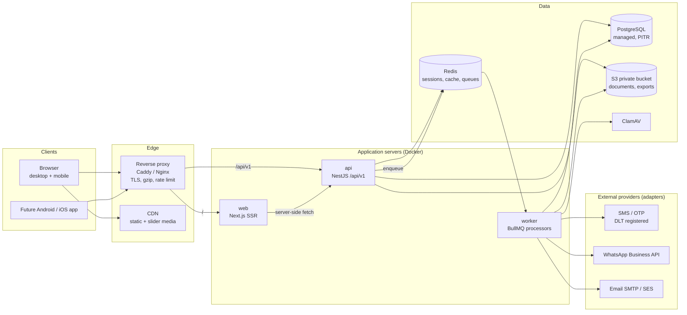

Request path: browser → proxy → Next.js page (SSR) → browser calls `/api/v1/*` on the same domain with an httpOnly session cookie. Mobile apps use the same endpoints with a bearer token.

---

## 4. Frontend architecture

* **Route groups:** `(auth)` for login / OTP / reset, `(app)` for signed-in screens with the shell (sidebar on desktop, bottom nav + floating "Add New Case" button on mobile).
* **Session:** `GET /api/v1/auth/me` returns the user, role, DSA/Team relationship and effective permission codes. The UI uses them only to show or hide menus and buttons.
* **No business rules in components.** Status transitions offered in the UI come from the API (`GET /cases/:id/allowed-transitions`), so the state machine lives in one place.
* **Shared contracts:** `packages/shared` holds Zod schemas, enums and permission codes used by both web and api.
* **Performance:** server components for static shells, TanStack Query for data, skeleton loaders, debounced search (300 ms), paginated tables (never all cases in the browser), charts and videos lazy-loaded, `next/image` for slider images.
* **Resilience:** route-level error boundaries, friendly error messages mapped from API error codes, unsaved-changes warning on forms, drafts for the New Case wizard.
* **Design system (PART 71):** Button, Input, Select, Modal, Drawer, Table (desktop) / Card list (mobile), Badge / Status chip, Tabs, Timeline, File uploader, Search, Filters, Pagination, Toast, Confirm dialog (with required reason for financial changes), KPI tile, Chart, Empty / Error / Loading states.

Navigation by role:

| Menu | Admin | Executive | DSA | Team Partner |
|---|---|---|---|---|
| Dashboard | ✓ | ✓ | ✓ | ✓ |
| New Case | ✓ | ✓ | ✓ | ✓ |
| All Cases | ✓ all | ✓ by scope | ✓ own + team | ✓ own |
| Team Data | ✓ | ✓ | ✓ | — |
| Payout | ✓ manage | ✓ manage if permitted | view | view own |
| Project Master | manage | manage if permitted | view | view |
| Checklist | manage | view / manage if permitted | view | view |
| Bankwise Code | manage | manage if permitted | view authorised | view authorised |
| Banker Directory | manage + share | manage + share if permitted | view permitted | view permitted |
| Raise Query / Need Assistance | answer | answer | raise | raise |
| Insurance, Recovery, KYC | manage | manage if permitted | view own | view own |
| Users & Permissions | ✓ | per permission | Team Partners only | — |
| Sliders, Notifications, Reports, Audit | ✓ | per permission | reports on own data | — |

---

## 5. Backend architecture

NestJS modules, one folder each, each exposing a controller (HTTP), a service (business rules) and a repository (Prisma):

`auth`, `otp`, `users`, `rbac`, `partners` (DSA + Team Partner), `executives`, `cases`, `case-workflow`, `customers`, `projects`, `checklists`, `banks`, `bank-codes`, `bankers`, `payouts`, `payout-rates`, `kyc`, `insurance`, `recovery`, `documents`, `queries`, `support` (Need Assistance), `notifications`, `sliders`, `reports`, `search`, `audit`, `settings` (master data), `health`, and `integrations` (SMS, WhatsApp, email, storage, antivirus adapters).

Every request passes the same pipeline (PART 55):

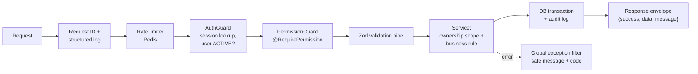

* Role and ownership always come from the server-side session, never from the request body or headers.
* `ScopeService.caseWhere(user)` returns the Prisma `where` clause for the user's scope (Admin: all; Executive: all or assigned DSAs [Q8]; DSA: `dsa_id = me`; Team Partner: `team_partner_id = me`). Every case, payout, recovery, report and export query uses it.
* Provider adapters sit behind interfaces (`SmsProvider`, `WhatsAppProvider`, `EmailProvider`, `StorageProvider`, `KycProvider`, `OcrProvider`, `BankApiProvider`, `BureauProvider`, `PaymentProvider`) so vendors can be swapped by config (PART 95).

---

## 6. Database architecture

Conventions: UUID primary keys (`uuid v7` for index locality) plus human IDs where users see them (`LDSA-2026-000001`, `Q-2026-000123`). Every table has `created_at`, `updated_at`; important tables add `created_by`, `version` (optimistic locking) and `deleted_at` / `deleted_by` (soft delete). Money `NUMERIC(15,2)`, percentages `NUMERIC(6,3)`.

### 6.1 Identity, organisation and access

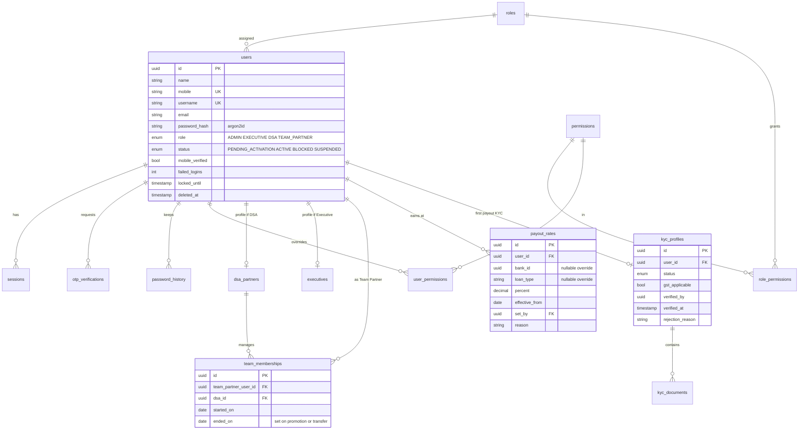

### 6.2 Cases and workflow

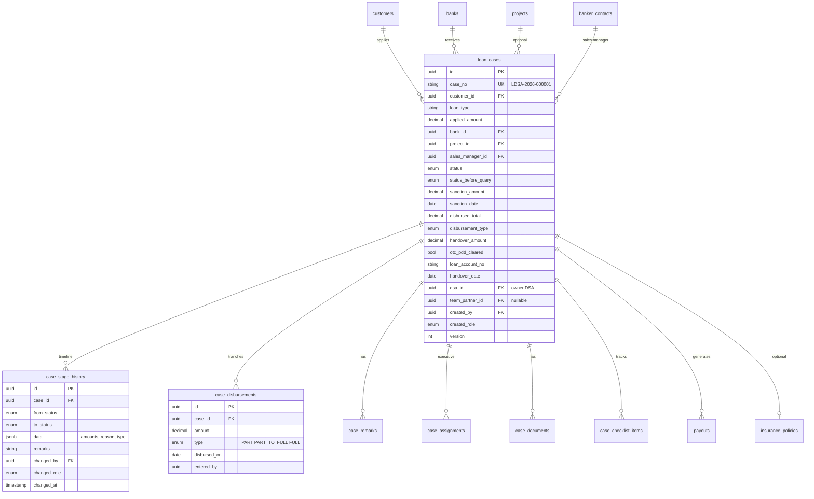

### 6.3 Finance

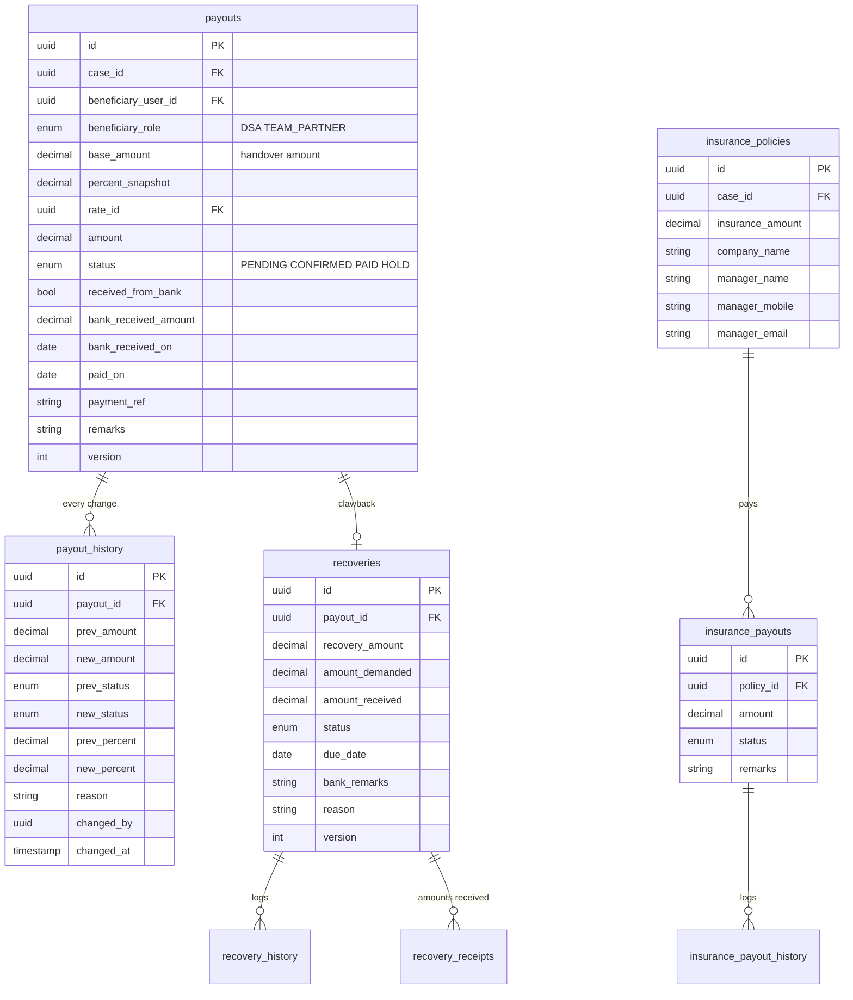

A unique index `payouts(case_id, beneficiary_user_id)` guarantees a Handover can never create two payouts for the same person, even if the request is sent twice (PART 58).

### 6.4 Master data, communication, content, system

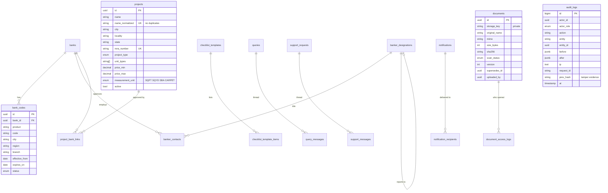

Other tables (not drawn): `bank_regions`, `project_types`, `project_unit_types`, `loan_types`, `query_categories`, `notification_categories` (all admin-configurable, PART 72), `sliders`, `slider_campaigns`, `saved_filters`, `recent_cases`, `idempotency_keys`, `case_counters`, `system_settings`, `background_jobs` (BullMQ keeps live job state in Redis; this table keeps a durable record of exports and bulk sends).

### 6.5 Indexes (PART 80)

`loan_cases`: unique `case_no`; `(dsa_id, created_at desc)`; `(team_partner_id, created_at desc)`; `(status, created_at)`; `bank_id`; `project_id`; `loan_account_no`; partial index on non-deleted rows. `customers`: `mobile`, trigram index on `name` for search, `pan`. `payouts`: `(status)`, `(beneficiary_user_id, status)`. `recoveries`: `(status, due_date)`. `audit_logs`: `(entity, entity_id)`, `(actor_id, at)`. Indexes will be reviewed against real query plans with seeded data (1M cases) in Phase 19.

---

## 7. Role and permission matrix

Legend: **A** = allowed · **C** = configurable by Admin (default on) · **c** = configurable (default off) · **O** = own records · **T** = own + team · — = never.

| Permission | Admin | Executive | DSA | Team Partner |
|---|---|---|---|---|
| USER_CREATE (DSA) | A | c | — | — |
| USER_CREATE (Team Partner) | A | C | T (own team) | — |
| USER_CREATE (Executive) | A | — | — | — |
| USER_RESET_PASSWORD | A | C | T (team) | — |
| USER_BLOCK / USER_SUSPEND | A | C | — | — |
| USER_DELETE (soft) | A | — | — | — |
| USER_PROMOTE (Team Partner → DSA) | A | — | — | — |
| PERMISSION_MANAGE | A | — | — | — |
| CASE_CREATE | A | C | A | A |
| CASE_VIEW_OWN / TEAM / ALL | ALL | ALL or assigned [Q8] | T | O |
| CASE_UPDATE (details) | A | C | T, before Handover | O, before Handover |
| CASE_STATUS_CHANGE | A | C | T [Q1] | O [Q1] |
| CASE_FINANCIAL_CORRECTION (sanction/disbursed/handover amounts after entry) | A | C | — | — |
| CASE_REOPEN (from Reject/Withdraw) | A | c | — | — |
| PAYOUT_VIEW | A | C | T | O |
| PAYOUT_UPDATE (status, amount) | A | C | — | — |
| PAYOUT_MARK_BANK_RECEIVED | A | C | — | — |
| PAYOUT_PERCENTAGE_UPDATE (DSA rate) | A | — | — | — |
| PAYOUT_PERCENTAGE_UPDATE (Team Partner rate) | A | c | T [Q16] | — |
| KYC_UPLOAD | A | C | — | — |
| KYC_VERIFY (final) | A | — | — | — |
| INSURANCE_VIEW / UPDATE | A / A | C / C | T / — | O / — |
| RECOVERY_VIEW / UPDATE / DEMAND | A / A / A | C / C / C | T / — / — | O / — / — |
| WHATSAPP_SEND (recovery, banker share) | A | c | — | — |
| PROJECT_VIEW | A | A | A | A |
| PROJECT_CREATE / UPDATE / DELETE | A | C / C / c | — | — |
| CHECKLIST_VIEW / MANAGE | A / A | A / c | A / — | A / — |
| BANK_CODE_VIEW / MANAGE | A / A | A / C | authorised / — | authorised / — |
| BANKER_VIEW / CREATE / UPDATE / DELETE | A | A / C / C / c | permitted / — | permitted / — |
| BANKER_SHARE | A | C | — | — |
| QUERY_CREATE / QUERY_ANSWER | A / A | A / C | A / — | A / — |
| SUPPORT_CREATE / SUPPORT_HANDLE | A / A | A / C | A / — | A / — |
| NOTIFICATION_SEND (broadcast) | A | c | — | — |
| NOTIFICATION_SEND (individual) | A | C | — | — |
| SLIDER_MANAGE | A | c | — | — |
| REPORT_VIEW / EXPORT | ALL | scope | T | O |
| GLOBAL_SEARCH | ALL | scope | T | O |
| AUDIT_VIEW | A | c | — | — |
| SETTINGS_MANAGE (master data) | A | c | — | — |

Rules that cannot be switched on for DSA or Team Partner regardless of configuration: changing payout status/amount, changing recovery values, verifying KYC, viewing other teams' data. A DSA sending `PATCH /api/v1/payouts/123` gets `403 FORBIDDEN` and the attempt is written to the audit log.

---

## 8. Team hierarchy and promotion

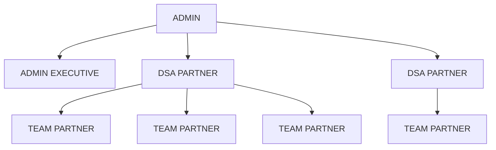

* A Team Partner belongs to exactly one DSA at a time through `team_memberships` (start/end dates), so history survives transfers.
* A Team Partner cannot create users; the API rejects it even if the button is forced visible.
* **Promotion (Team Partner → DSA)**, one transaction: end the current membership, create a `dsa_partners` profile for the **same user id**, change the role, copy over their KYC status, carry forward their payout rate as the starting DSA rate only if Admin confirms, write an audit entry with a mandatory reason. Old cases keep their original `dsa_id` and `team_partner_id`, so the former DSA's reports do not change; the promoted user still sees the cases they created [Q10].

---

## 9. Case state machine

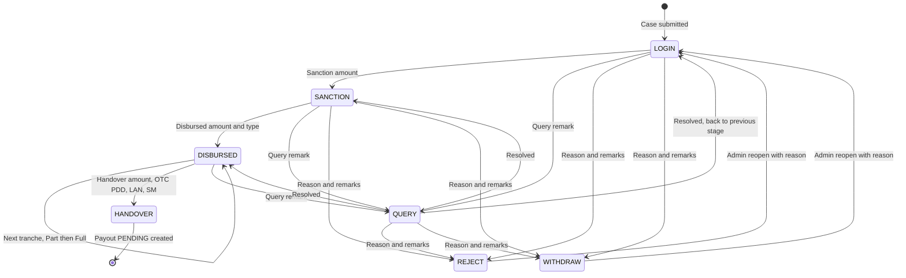

| Transition | Required input (validated by API) | Side effects |
|---|---|---|
| submit → LOGIN | customer name, loan type, applied amount, bank; optional mobile, project, sales manager | Case number generated; duplicate check; history row |
| LOGIN → SANCTION | sanction amount (> 0) | sanction date, user, timestamp stored permanently |
| SANCTION → DISBURSED | amount (> 0, ≤ sanction unless Admin override), type Part / Part to Full / Full | tranche row; running total |
| DISBURSED → HANDOVER | handover amount, OTC/PDD cleared Y/N, loan account number, SM name, SM email | **One transaction:** lock case row → validate → update → history → create payout(s) PENDING with rate snapshot → audit → commit, else rollback |
| any active → QUERY | query remark | remark row (never overwritten); remembers the stage to return to |
| QUERY → previous stage | resolution remark | history row |
| → REJECT / WITHDRAW | reason (from configurable list) + remarks | history row; case read-only |
| REJECT / WITHDRAW → LOGIN | Admin only, reason | audit |

Rules: no skipping stages (e.g. LOGIN → HANDOVER) unless Admin enables a named shortcut in settings. After Handover, only Admin/Executive with `CASE_FINANCIAL_CORRECTION` may correct amounts, each correction needs a reason and is logged with before/after values. Handover from a Part disbursement is allowed by default [Q5]. Case numbers come from a `case_counters` row locked inside the insert transaction, format `LDSA-{year}-{000001}`, restarting each year [Q6].

---

## 10. Payout state machine

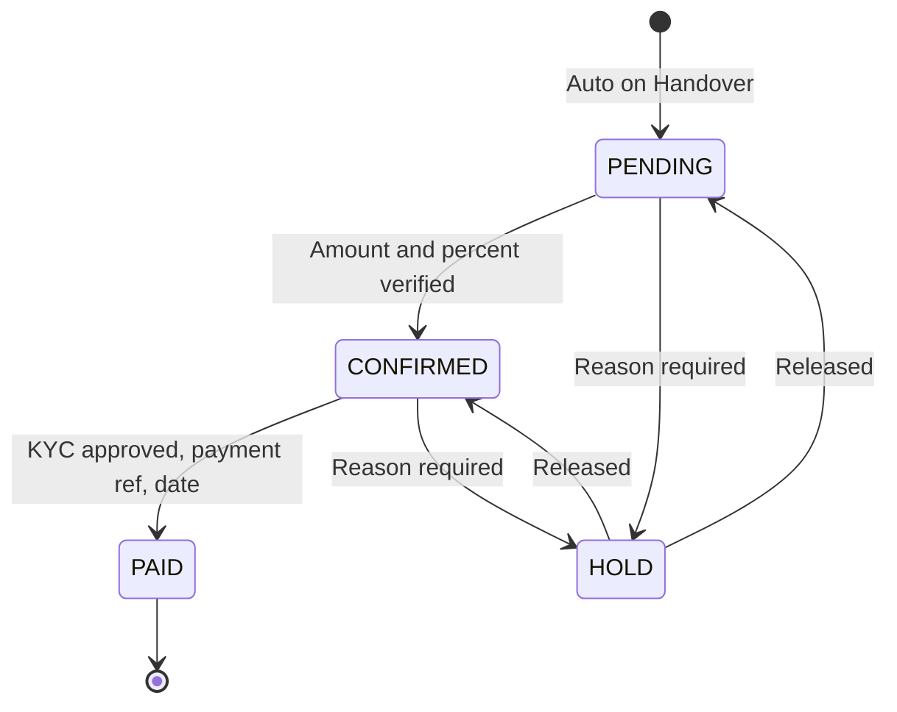

* **Amount** = handover amount × beneficiary's rate effective on the handover date (bank / loan-type specific rate if one exists, else the default rate). The rate and its id are stored on the payout. Later rate changes never alter existing payouts; an Admin can recalculate one payout explicitly, with a reason, and both values go to `payout_history`.
* **Who is paid** [Q2]: for a DSA's own case, one payout to the DSA. For a Team Partner's case, two lines: the DSA line (DSA rate) and the Team Partner line (Team Partner rate). Both are visible to the DSA; the Team Partner sees only their own line.
* **"Payout Received From Bank"** is tracked as a separate flag with amount and date rather than a step in the chain, because the bank can pay the company before or after the partner is paid [Q3]. The payout list can filter on it and the dashboard shows it.
* **First payout KYC gate:** `CONFIRMED → PAID` is refused with `KYC_NOT_APPROVED` until the beneficiary's KYC is `APPROVED`. The payout screen shows the warning "First payout KYC verification pending" [Q4].
* All updates require a reason, run in a transaction with the row's `version` checked, and accept an `Idempotency-Key` header.

---

## 11. First Payout KYC workflow

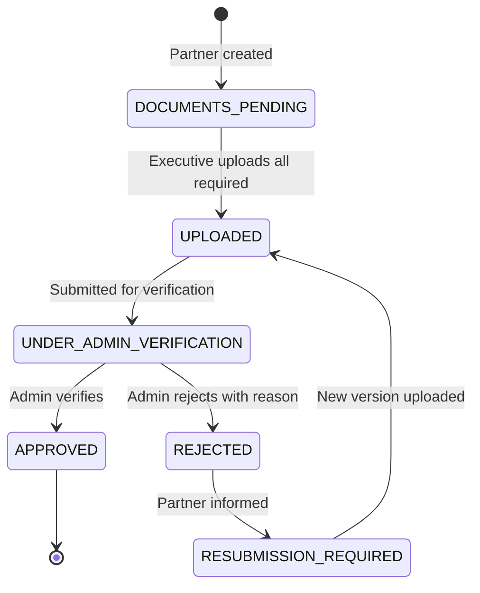

Required documents: PAN card, Aadhaar card, cancelled cheque, photograph, GST certificate when "GST applicable" is ticked. Each upload is a new document version (old versions kept). Stored per document: uploaded by, verified by, verification date, rejection reason, version. **[Improvement]** Aadhaar: only the last 4 digits are stored as text, the image is stored encrypted and should be the masked Aadhaar (first 8 digits hidden) to follow UIDAI guidance; access to KYC files is logged.

---

## 12. Insurance workflow

Admin/Executive adds an insurance policy to a case (amount, company, manager name/mobile/email, remarks). Each policy has its own **insurance payout** with the same states as a loan payout (`PENDING → CONFIRMED → PAID`, `HOLD`) and its own history table. Insurance payouts never mix with loan payout totals; dashboards show them in a separate "Insurance Payout" tile and report.

---

## 13. Recovery workflow

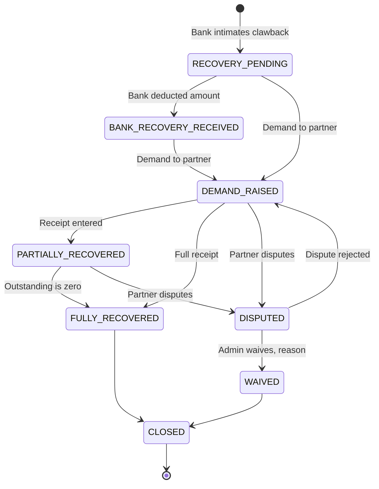

A recovery is linked to a payout. The demand screen shows Case ID, customer (name only), bank, original payout, recovery amount, amount demanded, amount received, outstanding (= demanded − sum of receipts, computed, never typed), status, due date, remarks. Receipts are rows in `recovery_receipts`, so totals are always traceable. DSA and Team Partner see their recoveries read-only.

**WhatsApp recovery message:** Admin (and Executives with `WHATSAPP_SEND`) pick a template with placeholders `{{dsa_name}} {{team_partner_name}} {{case_id}} {{customer_name}} {{recovery_amount}} {{due_date}}`. Only these fields are available; no mobile, PAN or loan account numbers of the customer are sent.

---

## 14. Authentication and OTP architecture

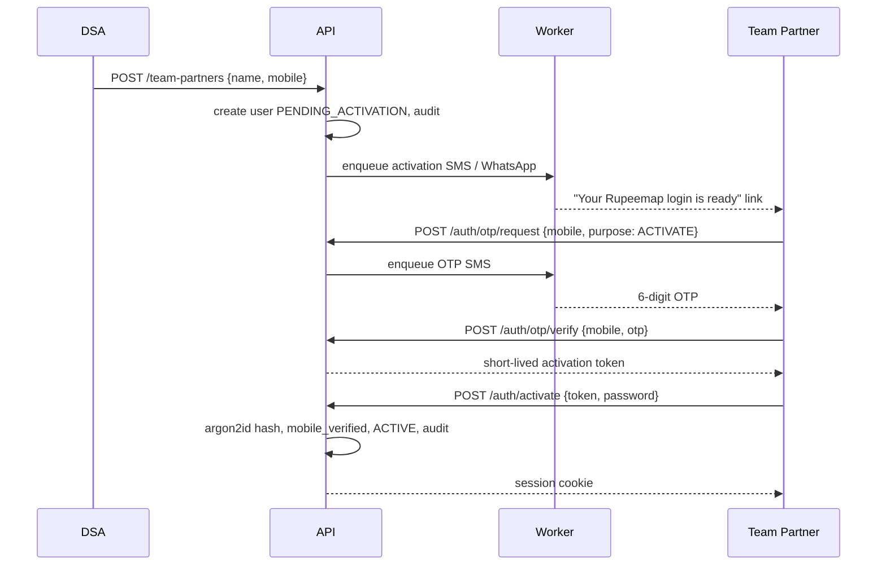

* **Passwords:** Argon2id (OWASP parameters: 19 MiB memory, 2 iterations). Minimum 8 characters with a breached-password check; last 5 hashes kept in `password_history` to stop reuse. Account lock for 15 minutes after 5 failed attempts.
* **OTP:** 6 digits, stored only as an HMAC hash, valid 5 minutes, max 3 attempts, one-time use, 30-second resend cooldown, max 5 requests per mobile per hour and per IP limits. Purposes: `ACTIVATE`, `RESET_PASSWORD`, `LOGIN_2FA` (optional for Admin). OTP values are never logged.
* **Sessions:** 256-bit random token, stored hashed in `sessions`, cached in Redis. Web: `httpOnly`, `Secure`, `SameSite=Lax` cookie plus CSRF token for writes. Mobile: `Authorization: Bearer`. Idle timeout 12 h for partners, 2 h for Admin/Executive (configurable). Blocking, suspending or changing a password revokes all sessions at once, and every request checks the user is still ACTIVE.
* **Forgot password:** mobile → OTP → new password. The response is identical whether or not the mobile exists, so accounts cannot be discovered.

---

## 15. Document architecture

* Upload: `POST /documents` (multipart) → size limit (10 MB, 25 MB for slider video), extension allow-list (pdf, jpg, jpeg, png, webp; mp4 for sliders), MIME detected from file bytes, filename sanitised, SHA-256 stored → object written to a **private** bucket under a random key → status `QUARANTINED` → worker scans with ClamAV → `CLEAN` or `INFECTED`.
* Download: `GET /documents/:id/url` checks permission and ownership, writes an access log for KYC and case documents, and returns a presigned URL valid for 60 seconds. Files are never in the public web directory.
* Versions: re-upload creates a new row with `supersedes_id`; nothing is overwritten.
* Slider media is the one exception: after Admin approval it is copied to a public CDN path.

---

## 16. Notifications, WhatsApp and email

* **In-app:** `notifications` (title, description, priority, attachment, start, expiry, related case) + `notification_recipients` (user, read_at). Audiences: everyone, all DSA, all Team Partners, all Executives, one user. Large audiences fan out in the worker in batches. Bell shows unread count; mark read / mark all read.
* **System events** create notifications automatically: status changes on your case, payout status change, query reply, recovery demand, KYC decision.
* **WhatsApp [Improvement]:** two levels. Level 1 (works on day one, no vendor approval): "Share via WhatsApp" opens WhatsApp with a prefilled message (`wa.me` link) on the Admin's phone or WhatsApp Web; the send is logged. Level 2: WhatsApp Business API through a provider adapter (Meta Cloud API, Gupshup, Interakt, etc.) with pre-approved templates, delivery status webhooks and retries. Recovery and banker-share messages start at Level 1 and switch to Level 2 once templates are approved.
* **Email:** SMTP or Amazon SES adapter, HTML templates, sent from the worker with 5 retries and exponential backoff; failures land in a dead-letter queue and on the Admin's failed-jobs screen. A failed email never fails the user's action.
* **SMS/OTP:** Indian DLT-registered sender ID and templates are required before OTP SMS can go live (see Risks).

---

## 17. Background jobs

Queues (BullMQ, Redis): `otp` (highest priority), `notifications`, `email`, `whatsapp`, `sms`, `exports`, `reports`, `document-scan`, `scheduled` (slider start/expiry, notification expiry, rate effective dates, nightly stats rollup, backup verification). Each job has retries with exponential backoff, a timeout, and moves to a `dead-letter` queue after the final failure, where Admin can retry or discard it. The worker is a separate container, so a stuck export cannot slow the API.

---

## 18. Caching strategy

| Data | Where | TTL / invalidation |
|---|---|---|
| Banks, loan types, project list, project types, unit types, query categories, settings | Redis | 1 h, cleared on any change to that master table |
| Bank codes, banker directory | Redis | 15 min, cleared on change |
| Session → user + permissions | Redis | cleared on logout, block, role or permission change |
| Dashboard KPIs | Redis, key includes the user's scope | 60 s |
| Case lists, payouts, recoveries, KYC | **not cached** | always read fresh (financial, user-specific) |
| Static assets, slider media | CDN | immutable hashed filenames |

---

## 19. Security architecture

* OWASP ASVS level 2 as the checklist. HTTPS only (HSTS), strict Content-Security-Policy, secure headers via Helmet.
* Server-side authorization on every endpoint (section 5). IDs in URLs are UUIDs, and every lookup is scoped, so guessing another case's ID returns 404.
* Input validation with Zod on every request; Prisma parameterised queries; raw SQL only through tagged templates.
* Financial actions: transaction + row lock or optimistic `version` check (409 CONFLICT "This case was changed by someone else, reload to continue") + idempotency key + mandatory reason + audit.
* Audit log is append-only: the application's database user has `INSERT, SELECT` only on `audit_logs`; each row stores a hash of the previous row so tampering is detectable. Passwords, OTPs, tokens and secrets are stripped before logging.
* Rate limits (Redis, per IP and per user): login, OTP, reset, search, case creation, uploads, notifications, WhatsApp, report generation.
* Secrets only in environment variables / a secrets manager; `.env.example` committed without values; secret scanning in CI.
* Encryption at rest for the database and bucket (provider-managed keys); PAN and Aadhaar last-4 stored in encrypted columns.
* Personal data: built to support India's Digital Personal Data Protection Act, 2023 (purpose-limited fields, access logs, deletion requests handled by anonymising the customer while keeping financial records).

---

## 20. API architecture

Base `/api/v1`. JSON only. Consistent envelope:

```json
{ "success": true, "data": {}, "message": "Operation completed successfully", "meta": { "page": 1, "pageSize": 20, "total": 134 } }
{ "success": false, "message": "You are not authorized to perform this action", "code": "FORBIDDEN", "requestId": "01J..." }
```

Error codes: `VALIDATION_ERROR`, `UNAUTHENTICATED`, `FORBIDDEN`, `NOT_FOUND`, `CONFLICT`, `INVALID_TRANSITION`, `KYC_NOT_APPROVED`, `DUPLICATE_SUSPECTED`, `RATE_LIMITED`, `INTERNAL_ERROR` (never with stack traces, SQL or paths).

| Module | Main endpoints |
|---|---|
| auth | `POST /auth/login`, `/logout`, `/otp/request`, `/otp/verify`, `/activate`, `/password/forgot`, `/password/reset`, `/password/change`, `GET /auth/me` |
| users | `GET/POST /users`, `PATCH /users/:id`, `POST /users/:id/block`, `/unblock`, `/suspend`, `/activate`, `/reset-password`, `/promote`, `GET/PUT /users/:id/permissions` |
| dsa / team-partners / executives | `GET/POST /dsa`, `GET /dsa/:id/team`, `POST /team-partners`, `GET /team-partners/:id/performance`, `GET/POST /executives` |
| cases | `GET/POST /cases`, `POST /cases/check-duplicate`, `GET/PATCH /cases/:id`, `GET /cases/:id/allowed-transitions`, `POST /cases/:id/transitions`, `GET /cases/:id/timeline`, `POST /cases/:id/remarks`, `POST /cases/:id/corrections`, `GET/POST /cases/drafts` |
| projects / checklists / banks / bankers / bank-codes | standard list (filter, sort, paginate), create, update, soft delete, activate; `POST /bankers/share` (WhatsApp or email, one or many bankers or designations) |
| payouts | `GET /payouts`, `GET /payouts/:id`, `PATCH /payouts/:id/status`, `PATCH /payouts/:id/amount`, `POST /payouts/:id/bank-receipt`, `GET/POST /payout-rates` |
| kyc | `GET /kyc/:userId`, `POST /kyc/:userId/documents`, `POST /kyc/:userId/submit`, `POST /kyc/:userId/approve`, `/reject` |
| insurance / recovery | `GET/POST /insurance`, `PATCH /insurance/:id/payout`; `GET/POST /recovery`, `POST /recovery/:id/demand`, `/receipts`, `/status`, `/whatsapp` |
| queries / support | `GET/POST /queries`, `POST /queries/:id/messages`, `PATCH /queries/:id` (assign, status); same for `/support` plus internal notes |
| notifications / sliders | `GET /notifications`, `POST /notifications/:id/read`, `/read-all`, `POST /notifications` (send); `GET /sliders/active`, CRUD + reorder for Admin |
| reports / search / audit | `GET /reports/{cases,dsa,team-partners,projects,banks,payouts,recovery,insurance,queries,executive-activity}`, `POST /reports/:name/export` (CSV, Excel, PDF → job), `GET /search?q=`, `GET /audit` |
| health | `GET /health` (liveness, public, no details), `GET /health/ready` (DB, Redis, storage; internal network only) |

Lists use `?page=&pageSize=&sort=&filter[...]` (max page size 100). OpenAPI (Swagger) is generated from the code for the future mobile team.

---

## 21. Folder structure

```
rupeemap-crm/
├─ apps/
│  ├─ web/                  Next.js
│  │  ├─ app/(auth)/…       login, otp, reset
│  │  ├─ app/(app)/…        dashboard, cases, team, payouts, projects, checklist,
│  │  │                     bank-codes, bankers, queries, assistance, notifications,
│  │  │                     reports, admin/{users,permissions,sliders,settings,audit}
│  │  ├─ components/ui/     design system
│  │  ├─ components/…       feature components
│  │  └─ lib/               api client, query hooks, formatters (₹, dates)
│  ├─ api/                  NestJS
│  │  └─ src/
│  │     ├─ common/         guards, filters, interceptors, pipes, scope, idempotency
│  │     ├─ modules/<name>/ controller, service, repository, dto, tests
│  │     └─ integrations/   sms, whatsapp, email, storage, antivirus adapters
│  └─ worker/               BullMQ processors (reuses api modules)
├─ packages/
│  ├─ db/                   prisma/schema.prisma, migrations, seed
│  ├─ shared/               zod schemas, enums, permission codes, state machines
│  └─ config/               eslint, tsconfig, tailwind preset
├─ infra/
│  ├─ docker/               Dockerfiles (web, api, worker)
│  ├─ compose/              docker-compose.dev.yml, docker-compose.prod.yml
│  └─ caddy/                reverse proxy config
├─ tests/
│  ├─ e2e/                  Playwright (desktop + mobile viewports)
│  └─ load/                 k6 scripts
├─ docs/                    this blueprint, runbooks, deployment, backup/restore
├─ .github/workflows/       ci.yml, deploy.yml
└─ .env.example
```

The state machines live in `packages/shared` as plain data (allowed transitions + required fields) and are executed only by the API; the web app reads them to label buttons.

---

## 22. Deployment architecture

| Environment | Setup |
|---|---|
| Development | `docker compose up`: Postgres, Redis, MinIO, ClamAV, Mailpit; apps run with hot reload; seeded demo users for every role |
| Staging | Same images as production, smaller VM, separate database and bucket, fake SMS/WhatsApp providers, anonymised data only |
| Production (launch) | One VM in Mumbai (4 vCPU / 8 GB) running Caddy, web, api ×2, worker, Redis via Docker Compose; managed PostgreSQL with automated backups and PITR; S3 bucket with versioning; CDN in front of static and slider media |
| Production (growth) | Same images on a container service (ECS / Kubernetes) with an autoscaled API, managed Redis, read replica for reports |

Deploy flow: merge to `main` → CI checks (install, typecheck, lint, unit, integration with a real Postgres, build, `prisma migrate diff` check, dependency audit, secret scan, E2E smoke) → images pushed → staging deploy + smoke tests → manual approval → **pre-migration database snapshot** → migrate → rolling restart → health checks → automatic rollback to the previous image if health fails. Migrations are written expand-then-contract so the previous version keeps working during a rollback.

---

## 23. Backup and disaster recovery

* Managed PostgreSQL: daily automated snapshots + point-in-time recovery (7–35 days). Target RPO ≤ 5 minutes.
* Nightly logical `pg_dump`, encrypted, copied to a bucket in a separate account/region. Retention: 30 daily, 12 monthly.
* Documents bucket: versioning on, deletes protected, lifecycle rules for old versions, cross-region replication for KYC documents.
* Redis holds nothing that cannot be rebuilt (sessions are re-login, jobs are re-queued from `background_jobs`).
* Monthly restore drill to staging, with the result recorded. Target RTO ≤ 4 hours for a full region failure, minutes for a bad deploy (image rollback) or bad data (PITR to a new instance).
* Runbooks in `docs/`: restore database, restore a single deleted record, rotate secrets, failed deploy rollback.

---

## 24. Monitoring and logging

* **Logs:** pino JSON with request id, user id, role, action, endpoint, duration, status, error code. Customer mobile, PAN and names are masked; passwords, OTPs and tokens are never logged.
* **Errors:** Sentry for web and api with release tags.
* **Metrics:** request rate, p95 latency per route, 5xx rate, DB pool usage, slow queries (> 500 ms), queue depth, failed jobs, login failures, OTP failures, storage errors, CPU/memory/disk.
* **Alerts:** API down, 5xx > 2 % for 5 min, p95 > 1 s, dead-letter queue > 0, backup failed, disk > 80 %, spike in login failures. Delivered by email and WhatsApp/Slack.
* **Uptime:** external check on `/health` every minute.

---

## 25. Testing strategy

| Layer | Tool | Focus |
|---|---|---|
| Unit | Vitest (shared, web), Jest (api) | state machines, payout maths, rate selection, scope builder, formatters |
| Integration | Jest + Testcontainers (real Postgres, Redis) | transactions, rollback on failure, optimistic locking, idempotency, audit writes |
| API | Supertest | every endpoint, response envelope, error codes |
| **RBAC matrix** | generated tests | every endpoint × every role × own/other data, driven from the permission matrix in section 7, so a new endpoint without a rule fails CI |
| E2E | Playwright, desktop + iPhone/Android viewports | the full PART 103 scenario, plus each PART 89 critical test |
| Security | OWASP ZAP baseline, dependency audit, secret scan, manual IDOR tests | |
| Performance | k6 with 1M seeded cases | case list, search, dashboard, handover under load |
| Responsive / visual | Playwright screenshots at 360, 768, 1280 px | |

---

## 26. Performance strategy

Targets on the launch VM: p95 < 300 ms for case list, case detail, dashboard; < 1 s for on-screen reports; exports run in the background. Tools: indexes in 6.5, keyset pagination on large lists, `SELECT` only needed columns, KPI queries grouped in one round trip, Redis for master data and KPIs, nightly rollup table `daily_case_stats` for long-range analytics once volume needs it, Postgres connection pooling (PgBouncer in growth stage), gzip/brotli, code splitting, lazy charts and videos, responsive images, CDN.

---

## 27. Improvements over the prompt

1. Disbursements stored as tranches (Part → Part to Full → Full) instead of one overwritten amount.
2. Query remembers the stage it came from and returns there when resolved.
3. "Payout received from bank" tracked separately from the partner payout status.
4. Payout rates can be set per bank / loan type as overrides of the default, with effective dates.
5. WhatsApp works on day one through prefilled links; the Business API is added once templates are approved.
6. Aadhaar masking, encrypted KYC storage and document access logs.
7. Tamper-evident audit log (hash chain, insert-only database permission).
8. Sessions revoked instantly when a user is blocked, suspended or changes password.
9. Draft cases, saved filters, recent cases, duplicate warning before submit, unsaved-changes warning, mobile floating "Add New Case" button (PART 96).
10. RBAC tests generated from the permission matrix.
11. Indian number formatting (lakh/crore) and IST timestamps throughout.

## 28. Ideas from established lending CRMs

You asked me to bring in what works in mature loan DSA and lending CRMs. These are features that show up again and again in Indian DSA partner apps and lending CRMs, filtered to the ones that fit your workflow without making it heavier.

**Adding by default** (each sits inside an existing phase, none changes the Login → Handover flow):

| Idea | What it does | Phase |
|---|---|---|
| Net payout with TDS and GST | Each payout shows gross commission, TDS under section 194H, GST (when the partner is GST registered) and net payable. Rates live in settings with effective dates, since they change by law [Q17]. | 9 Payout |
| Monthly payout statement | One PDF per partner per month listing cases, handover amounts, rates, deductions and net paid; GST-registered DSAs can download an invoice draft. Ends most "where is my payout" queries. | 9, 16 |
| Bank payout MIS reconciliation | Executive uploads the bank's payout MIS (Excel/CSV); the system matches rows by loan account number and marks payouts received from bank, listing mismatches for review. | 9 Payout |
| Case ageing and follow-ups | "Days in current stage" on every case, colour-coded buckets (0–7, 8–15, 16–30, 30+ days), a next follow-up date with reminder notifications, and a "stuck cases" list on the dashboard. | 5–6, 14 |
| Turnaround analytics | Average days Login → Sanction → Disbursed → Handover by bank, project, DSA and loan type, so you can see which banks are slow. | 16 Reports |
| Customer document link | Partner sends the customer a secure, expiring link (WhatsApp/SMS) to upload documents from their phone without an account; files land in the case checklist, scanned and private. | 8 Checklist |
| EMI and eligibility calculators | EMI, basic FOIR eligibility and balance-transfer savings calculators on the mobile dashboard, for partners talking to customers. No customer data stored. | 5 |
| Co-applicant | Optional co-applicant name and mobile on a case, included in duplicate checks. | 5 |
| Bulk import | Excel templates to import partners, projects, banks, bankers, bank codes and existing open cases, with a row-by-row error report before anything is saved. | 21 |
| Installable mobile app (PWA) | "Add to home screen" on Android/iPhone with an app icon and fast start, before building native apps. | 1, 19 |
| Two-step login for Admin and Executives | OTP on new device for the accounts that can change money. | 2 |

**Suggested for later** (your call; each adds work or changes the flow):

1. **Lead stage before Login**: capture enquiries and convert them to cases, with lead source tracking. Useful if partners also want to track prospects in the CRM.
2. **Bank product policy sheet**: per bank and product, current rate of interest, processing fee, max LTV, minimum CIBIL and eligible profiles, so partners pick the right bank before login.
3. **Partner leaderboard and targets**: monthly targets per DSA and Team Partner, progress bars, top performers by objective metrics.
4. **WhatsApp status bot**: partner sends a case number and gets its current status back.
5. **Credit bureau and KYC API checks**: CIBIL/Experian pull with customer consent, PAN verification API. The adapters in section 5 already leave room for these.

## 29. Risks and mitigations

| Risk | Mitigation |
|---|---|
| OTP SMS in India needs DLT registration of sender ID and templates (can take 1–3 weeks) | Start registration early; WhatsApp OTP or email OTP as a fallback; dev/staging use a fake provider |
| WhatsApp Business API template approval and per-message cost | Level 1 prefilled links first (section 16) |
| Payout business rules not fully specified (Team Partner lines, bank receipt, KYC scope) | Defaults below, isolated in one `payouts` service; confirm before Phase 9 |
| Storing Aadhaar/PAN images | Masked Aadhaar, encryption, access logs, restricted permissions |
| Single VM is a single point of failure at launch | Managed DB with PITR, images rebuildable in minutes, documented move to multi-instance |
| Scope is large (22 phases) | Build in the given order, usable milestone after Phase 6, phase reports after each |
| Existing data in spreadsheets | Import tool for partners, projects, banks, bankers and open cases (Phase 21) if needed |

## 30. Questions needing your confirmation

Defaults are already built into this blueprint; answer only where the default is wrong.

1. **Q1 Who moves case status?** Default: DSA and Team Partner can move their own cases through Login → Sanction → Disbursed → Handover, and to Query / Reject / Withdraw. Admin/Executive can do everything and correct amounts afterwards.
2. **Q2 Payout for Team Partner cases.** Default: two payout lines, one to the DSA at the DSA rate and one to the Team Partner at the Team Partner rate. Alternative: only the DSA is paid by Rupeemap and the Team Partner line is informational.
3. **Q3 "Payout Received From Bank".** Default: separate flag with amount and date, not a step between Pending and Paid.
4. **Q4 KYC gate.** Default: blocks `CONFIRMED → PAID` for any payout until the partner's KYC is Approved (it only ever triggers on the first one, since KYC stays approved). Should it also apply to Team Partners, or only DSAs?
5. **Q5** Can Handover happen after a Part Payment disbursement? Default: yes.
6. **Q6** Case number restarts every year (LDSA-2027-000001)? Default: yes.
7. **Q7** Payout percentage is applied on the Handover amount? Default: yes, as in PART 31.
8. **Q8** Do Executives see all cases, or only the DSAs assigned to them? Default: all.
9. **Q9** Should Team Partners see Bankwise Codes and banker contacts? Default: view only, Admin chooses which.
10. **Q10** After a Team Partner is promoted to DSA, do their old cases stay with the former DSA? Default: yes.
11. **Q11** Can a DSA set a Team Partner rate higher than their own rate? Default: no, capped at the DSA's rate.
12. **Q12 Providers:** which SMS, WhatsApp and email providers do you already use, if any?
13. **Q13 Hosting:** do you have a cloud account/domain (e.g. crm.rupeemap.com)? Default recommendation: AWS Mumbai.
14. **Q14 Branding:** Rupeemap logo and brand colours to use.
15. **Q15 Language:** English only, or also Hindi/Gujarati for partner screens?
16. **Q16 Code home:** which GitHub repository should the code go to?
17. **Q17 Deductions:** should payouts deduct TDS under 194H (default 2%, configurable) and add GST for GST-registered DSAs (default 18%)? Default: yes, both configurable.

---

## 31. Delivery plan

Phases follow PART 101 exactly. After each phase: typecheck, lint, tests, migration check, RBAC check, UI and mobile check, then a phase report (Completed / Working / Tests / Issues found / Issues fixed / Remaining / Next phase).

| Milestone | Phases | What you can try |
|---|---|---|
| M1 Foundation | 1 Setup + design system, 2 Auth + OTP, 3 RBAC + users, 4 DSA/Team hierarchy | Log in as each role, create DSA and Team Partner, OTP activation (fake SMS in preview) |
| M2 Cases | 5 Case management, 6 Workflow + timeline, 7 Project Master, 8 Checklist | Full Login → Handover flow on phone and desktop |
| M3 Money | 9 Payout, 10 Insurance, 11 Recovery (+ KYC) | Payout after Handover, KYC gate, recovery demand |
| M4 Operations | 12 Bankers + codes, 13 Queries + assistance, 14 Notifications, 15 Sliders | Complete daily operations |
| M5 Insight + hardening | 16 Reports, 17 Audit, 18 Security, 19 Performance, 20 Tests | Dashboards, exports, audit trail, load results |
| M6 Go-live | 21 Staging, 22 Production readiness | Staging URL, runbooks, go-live checklist |
